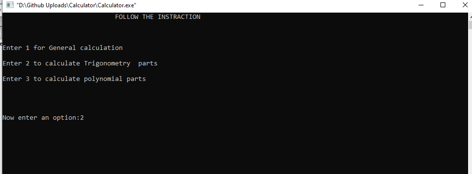
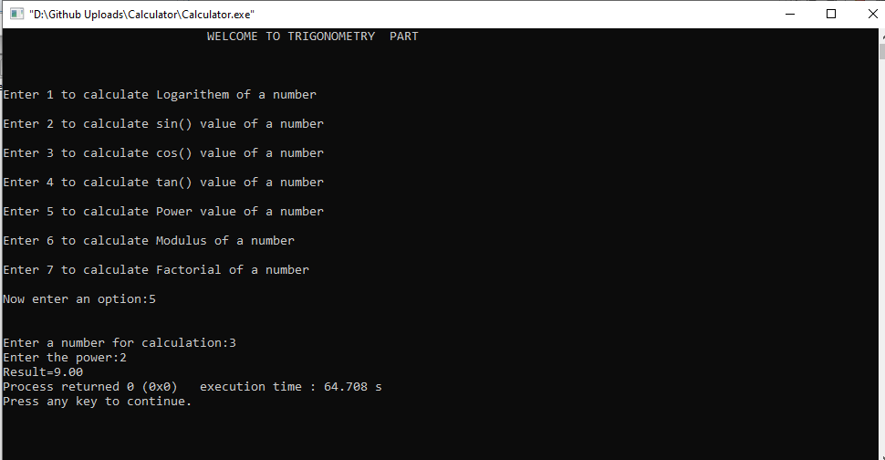
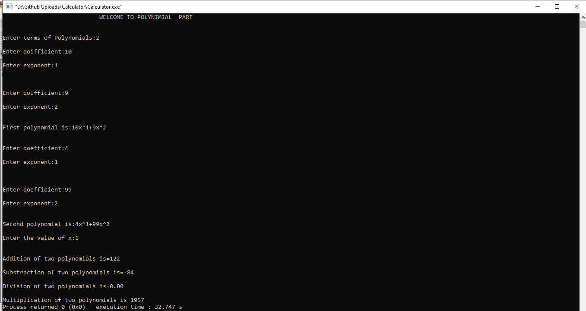

# Calculator
Customizable Scientific Calculator implemented by C programming. This program is able to perform all the general calculation along with the trigonometrical operations and also can perform addition, subtraction, multiplication and division operation between two polynomial functions.

Output Snapshot 1:

Output Snapshot 2: 

Output Snapshot 3: 

